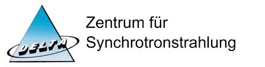

# *RefXAS* - Reference database for XAS

## Involved facilites:

### Deutsches Elektronen-Synchrotron DESY
{ align=left style="height: 40%; width: 40%; border-radius: 5px;" loading=lazy}          

### Center for Synchrotron Radiation
   

### University of Wuppertal
  

### Karlsruhe Institute of Technology
{ align=left style="height: 40%; width: 40%; border-radius: 5px;" loading=lazy}          

### Technische Universität Berlin
{ align=left style="height: 40%; width: 40%; border-radius: 5px;" loading=lazy}           

### DAPHNE4NFDI
{ align=left style="height: 40%; width: 40%; border-radius: 5px;" loading=lazy}
